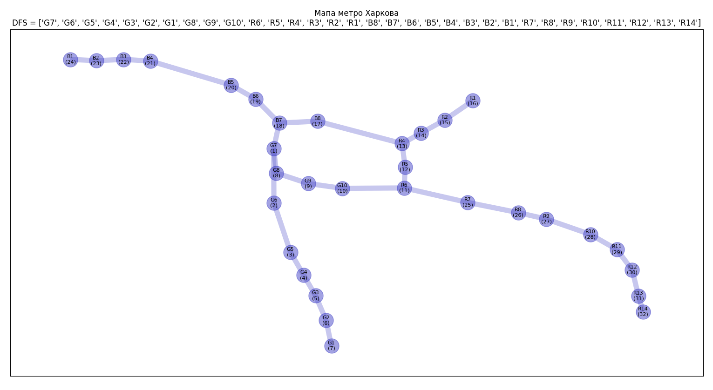
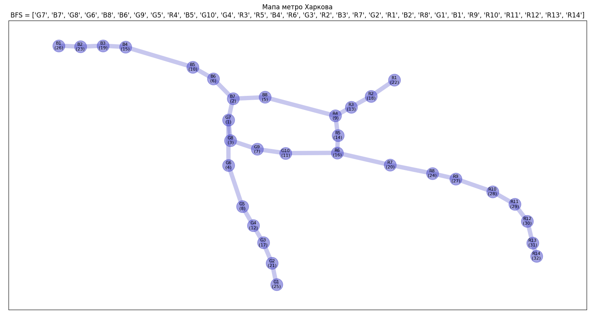

Результати виконання алгоритму пошуку шляхів DFS представлено на малюнку (під назвами вершин вказано порядковий номер відвідування вершини): 

Результати виконання алгоритму пошуку шляхів BFS представлено на малюнку (під назвами вершин вказано порядковий номер відвідування вершини): 

На тестовому прикладі алгоритм стартував з вершини G7.

Для алгоритму DFS просування було швидким, ніби рухалися ланцюгами від однієї вершини переход до іншої, і так далі, що й відображає сутність алгоритму DFS.

Для алгоритму BFS просування було повільним, ніби рухалися хвилями від епіцентру (старту): спочатку пройшли по сусідам першого рівня, потім по всім сусулам другого рівня, третього, ..., і т.д., що й відображає сутність алгоритму пошуку в ширину BFS.